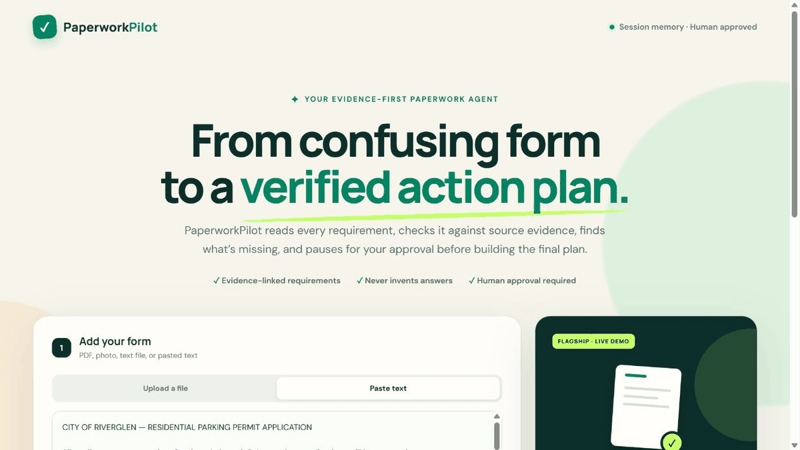

# PaperworkPilot AI

PaperworkPilot is a stateful paperwork assistant that turns pasted or uploaded forms into an evidence-backed action plan. It explains requirements in plain language, identifies missing information, suggests answers only from user-provided details, lists supporting documents, flags ambiguity, and produces a final checklist after human approval.

**Live application:** https://paperwork-pilot-ai.replit.app/



## Agent workflow

1. Treat uploaded content as untrusted input.
2. Extract fields, documents, deadlines, choices, and warnings.
3. Verify requirements against exact source text.
4. Match only profile details supplied by the user.
5. Route uncertainty and sensitive requirements to review.
6. Pause and save state for a human decision.
7. Resume the same run to build the final plan, or stop safely.

## Technology

- Python, FastAPI, LangGraph, Pydantic, and pypdf
- OpenAI Responses API for live structured extraction and scanned-document reading
- HTML, CSS, and JavaScript frontend
- Replit-ready runtime configuration

## Run locally

```bash
python -m venv .venv
# Windows: .venv\Scripts\activate
# macOS/Linux: source .venv/bin/activate
pip install -r requirements.txt
python -m uvicorn backend.app:app --reload --port 3000
```

Open `http://localhost:3000`.

For live form analysis, copy `.env.example` to `.env` and set `OPENAI_API_KEY`. The fictional demonstration scenarios run without an API key.

## Run the checks

```bash
python -m unittest discover -s test -v
```

## Project structure

```text
agent/          Stateful graph, schemas, tools, and fictional scenarios
backend/        FastAPI application and run/resume endpoints
public/         Responsive browser interface
assets/         Animated product preview
samples/        Fictional forms for safe demonstrations
test/           Unit, API, and interface contract tests
docs/           Technical architecture
```

## Safety

PaperworkPilot does not submit forms, make payments, provide eligibility decisions, or invent personal facts. The user must review the evidence and approve the final-plan boundary. Do not use real sensitive paperwork without appropriate authentication, encryption, retention controls, and privacy review.
